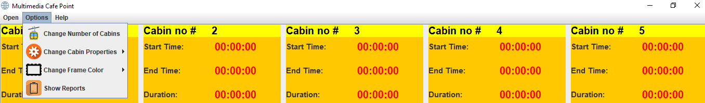

## Project Name
Cafe-point | Cyber-cafe | Cafe-MS

## Description
A simple desktop application manages any cyber cafe's cabins information. For example: number of cabins, time period of alloted cabin, income generated by each alloted time section, income generated by whole day etc...  

## Motivation
This project is made by me when I was in third semester of my engineering studies. I made this project for fun :) because I always wanted to see how these projects build and work. So, for checking my skills I decided to work on that simple idea... 

## Technologies
- Java | base technology
- java swing | for building app windows
- java awt | for handing events and listeners
- java file r-w system | for file-based database systems.


## Future Work

- Improve or re-engineer UI.
- Replacing File based system to database systems.
- Main UI color schema selection option.
- Analysis and graph panel integrated to report section.

## Execute and Run project
In order to run open the terminal and execute the following commands.

```cmd
javac *.java
java CafeShop
```

## UI
The user interface is crazy and ugly because when I was in the begining I was unaware of the design concept. So, at that time I haven't focused on design aspects of the application. 

- Main UI


- Report


- Menu




